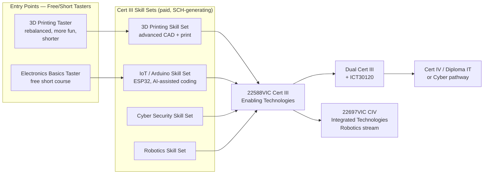
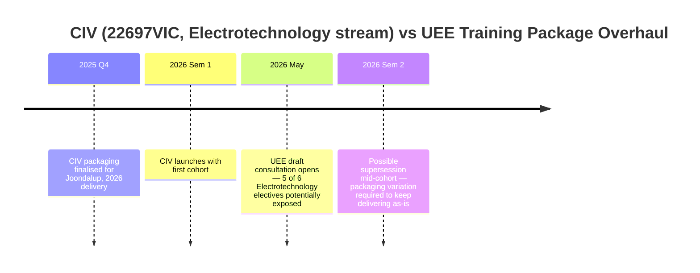

# Enabling Technologies (22588VIC) Pathway — Internal Summary
**Prepared by:** [Your name] · Integrated Technologies, Joondalup
**Status:** Working document — contains illustrative figures marked for replacement with actuals

---

## 1. The problem in one paragraph

The proposed 22697VIC CIV in Integrated Technologies, packaged with an Electrotechnology-stream elective set, leans on 5 of its 6 Electrotechnology-stream elective units (UEECD0007, UEECD0019, UEECD0046, UEERL0003, UEECD0052) directly from the national UEE Electrotechnology Training Package, with zero spare capacity in that stream. This risk is specific to the Electrotechnology-stream packaging — the same qualification code can also be packaged with a Robotics-stream elective set, which draws on Victorian-coded and imported Manufacturing-package units instead and is not exposed to the UEE review in the same way. The UEE package is currently under a full review (74 qualifications, 552 units, draft consultation May 2026), landing mid-way through the CIV's proposed first delivery year. Meanwhile, ICT/programming enrolments are softening — plausibly linked to broader hesitancy about AI's effect on programming careers — and a single long qualification format is producing high non-completion/repeat rates. Betting 2026 delivery capacity on the CIV risks a course that's redundant before it produces a graduating cohort, while a proven-demand alternative (3D printing) sits under-leveraged.

## 2. What I'm proposing instead

Shift the primary 2026 investment from the CIV to **22588VIC Certificate III in Enabling Technologies**, delivered as a stack of individually-enrollable skill sets/short courses rather than one long qualification — feeding into the full Cert III, and potentially a dual Cert III with an NMTAFE ICT qualification (ICT30120 assumed, TBC).

**Why Enabling over Emerging (22589VIC):** Enabling's streams (IoT, Industry 4.0, 3D printing, robotics, networking, cybersecurity, hardware) map directly onto what Joondalup's Integrated Technologies portfolio already teaches. Emerging (game design/Unity/product design) is a second, later opportunity — not the one to lead with.

## 3. Proposed pathway shape

**Deliberate design choice:** each skill set is independently swappable. If a unit inside one stream gets superseded (e.g. as part of the UEE overhaul, should it touch anything cross-listed), only that skill set needs updating — not a full CIV packaging variation.

**Note on the Robotics-stream CIV:** NMTAFE's own published Robotics & Automation pathways map (Dec 2025) already shows this exact progression — Cert III skill sets (PLC-based, IoT/robotics coding) feeding into the Robotics-stream 22697VIC CIV at Cert IV. The Enabling Technologies pathway proposed here isn't competing with that progression, it's a complementary on-ramp into it.

## 4. Risk collision: CIV timeline vs UEE overhaul

The Robotics-stream packaging of the same qualification code does not carry this exposure — its elective set draws on Victorian-coded and Manufacturing-package units, none of which sit inside the UEE review.

## 5. SCH bridge — illustrative only, not verified

The core financial argument: skill sets generate SCH *now*, while the Cert III itself is scoped and (if needed) added to NMTAFE's scope of registration. This is a template — every number below needs your actual cohort/waitlist data before it goes near your director.

| Stream | Nominal hrs | Illustrative cohort | Illustrative SCH | Basis |
|---|---|---|---|---|
| 3D Printing Skill Set (rebalanced) | ~40 | *[replace — current waitlist size]* | *[calc]* | Only stream with proven current demand |
| Electronics/IoT free taster | ~20 | *[replace]* | *[calc]* | New; unproven, assumed similar draw to 3D printing interest |
| IoT/Arduino Cert III Skill Set (VU23158–60) | 120 | *[replace]* | *[calc]* | Conversion rate from taster is the key unknown |
| Cyber Security Skill Set | ~40 | *[replace]* | *[calc]* | You flagged cyber as consistently popular — worth checking your own cyber elective enrolment history to substantiate this before presenting it as fact |
| Robotics Skill Set | ? | ? | ? | **Blocked on Section 6 data** |
| Full 22588VIC completions (dual w/ ICT30120) | 400+ | *[replace]* | *[calc]* | Depends on skill-set-to-full-qual conversion rate — unknown until piloted |

## 6. Existing robotics courses — resolved

Checked: the Robotics-stream packaging of 22697VIC does not carry the same UEE exposure as the Electrotechnology-stream packaging. Its elective set is built entirely from Victorian-coded units and imported Manufacturing-package (MEM) units, with no UEE-coded units in the mix. So the redundancy risk in this proposal is specific to the Electrotechnology-stream CIV, not a portfolio-wide pattern — worth being precise about that distinction with your director rather than implying robotics is equally at risk.

**Still worth confirming:** actual current enrolment/SCH figures for the robotics offering, so the "progression endpoint" claim in Section 3 has real numbers behind it.

## 7. Parent/school appeal

- "Emerging Technologies" and "Enabling Technologies" both test well as names for parent-facing marketing — technical enough to sound credible, vague enough to not scare off non-technical students.
- Skill-set/short-course structure supports flexible delivery, including **into schools via VETDSS**, which is a distinct enrolment channel from direct TAFE enrolment and worth quantifying separately in the proposal — schools bring cohorts, not individual sign-ups.
- The taster → skill set → Cert III funnel gives schools an easy low-commitment entry point (a single day/term taster) before committing a student to a full VETDSS Cert III pathway.

## 8. What's solid vs what needs work before this goes to your director

**Solid (verified across this conversation):**
- UEE overhaul is real, current, and large in scope
- The Electrotechnology-stream CIV's specific unit-level exposure (5 of 6 electives, zero buffer)
- The Robotics-stream CIV is not exposed to the same risk (Section 6)
- 22588VIC/22589VIC's stream/skill-set structure and stackability
- The naming/parent-appeal logic
- NMTAFE's own published pathways map already models a skill-set-to-Cert-IV funnel for Robotics & Automation — precedent for this proposal's structure

**Needs your data before presenting as fact:**
- Actual current enrolment/completion/repeat rates on programming-heavy quals
- Actual 3D printing waitlist numbers
- Current robotics course enrolment/SCH, to support the progression-endpoint claim
- Whether NMTAFE currently has 22588VIC on scope of registration, or needs a scope variation
- Realistic conversion rates (taster → skill set → full Cert III)
