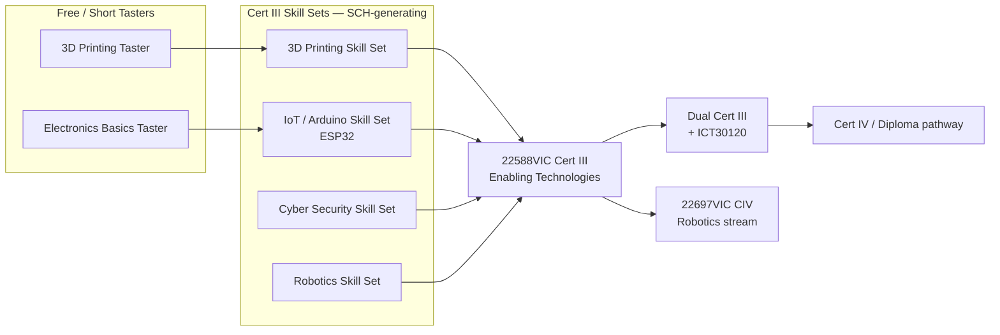

# Proposal: Enabling Technologies Skill-Set Pathway — Joondalup
**To:** [Director's name]
**From:** [Your name]
**Date:** [Date]
**Purpose:** Redirect 2026 development priority from 22697VIC (CIV) to a skill-set-based 22588VIC Certificate III pathway, to protect SCH, reduce redundancy risk, and improve completion rates.

---

## Executive summary

- Enrolments in current programming-heavy qualifications are declining, with high non-completion/repeat rates on long single-qualification formats. *(Actual figures to be inserted — [Your name] to confirm before circulation.)*
- The proposed CIV (22697VIC) depends on 5 of its 6 core Electrotechnology-stream units directly from the national UEE Training Package, which is currently under a major, confirmed federal review (draft consultation May 2026) — creating a real risk the qualification requires rework before its first cohort finishes.
- A skill-set-based pathway into 22588VIC Certificate III in Enabling Technologies offers multiple, smaller SCH-generating entry points instead of one long-format bet, using a stream (IoT, 3D printing, cyber, robotics) we already have proven demand for in at least one area.
- **Ask:** approval to pilot the skill-set model in 2026, starting with the stream with existing demand, and development/delivery hours allocated to build it.

## 1. Why this is on the table now

The CIV was raised as the 2026 development priority for the Electrical/Electronics and Integrated Technologies portfolio. Before committing development time to it, the units it depends on were checked against the current status of the national UEE Training Package.

## 2. Risk register — CIV (22697VIC)

| Risk | Detail | Status |
|---|---|---|
| UEE Training Package overhaul | Full review in progress: 74 qualifications, 552 units, draft consultation May 2026 | Confirmed, current |
| Unit-level exposure (Electrotechnology-stream CIV) | 5 of 6 Electrotechnology-stream electives (UEECD0007, UEECD0019, UEECD0046, UEERL0003, UEECD0052) are national UEE units, not VIC-specific | Confirmed against the qualification's designated stream structure |
| No buffer capacity | Stream requires exactly 6 units; exactly 6 are selected — no spare units if any are superseded | Confirmed |
| Timing collision | CIV proposed for 2026 delivery; UEE consultation lands mid-year | Confirmed |
| Robotics-stream CIV exposure | The same qualification code, packaged with a Robotics-stream elective set instead, draws on Victorian-coded and imported Manufacturing-package units — no UEE-coded units | **Not exposed** — risk is specific to the Electrotechnology-stream packaging |

## 3. Proposed pathway

Each skill set is independently updatable — a unit change in one stream (e.g. from a training package review) doesn't require re-approving the whole pathway.

**This isn't a new model.** NMTAFE's own published Robotics & Automation pathways map already shows Cert III skill sets feeding into a Cert IV CIV. This proposal extends that same, already-endorsed structure to Enabling Technologies, and feeds students toward the Robotics-stream CIV rather than competing with it.

## 4. SCH logic — the core financial case

Rather than one CIV enrolment event per student, the skill-set model creates multiple funded touchpoints per student as they move taster → skill set → Cert III → dual Cert III. This also means SCH starts flowing as soon as the first skill set launches, rather than waiting for a full CIV cohort to complete.

*(Table below is illustrative to show the model's shape — [Your name] to populate with actual cohort and SCH figures before this is finalised.)*

| Stream | Nominal hrs | Cohort (real figure needed) | SCH (real figure needed) |
|---|---|---|---|
| 3D Printing Skill Set | ~40 | | |
| IoT/Arduino Skill Set | 120 | | |
| Cyber Security Skill Set | ~40 | | |
| Robotics Skill Set | | | |
| Full Cert III completions | 400+ | | |

**3D printing is the one stream with proven current demand** (consistently full) — proposed as the pilot stream to prove the model before scaling to IoT, cyber and robotics.

## 5. Continuity — protecting SCH while this ramps up

The skill-set model is designed to **run alongside** existing delivery, not replace it overnight — early skill-set intakes generate SCH while the full Cert III pathway (and any scope-of-registration steps required) is finalised, avoiding a gap in delivery during the transition.

## 6. Parent and schools appeal

- Skill sets/short courses support flexible delivery, including into schools via VETDSS — a distinct, cohort-based enrolment channel.
- "Enabling Technologies" tests well with parents: technical enough to feel credible, accessible enough not to gatekeep on prior coding experience — directly addressing the enrolment softness in code-first messaging.
- Proposed funnel: single-day/term school taster → skill set → full VETDSS Cert III pathway, giving schools a low-commitment entry point before a full qualification commitment.

## 7. What's being asked for

- Approval to pilot the skill-set pathway in 2026, starting with the proven-demand stream (3D printing) and one new stream (IoT/Arduino).
- Development and delivery hours allocated to [Your name] to design, scope, and run the pilot.
- A decision point on whether the CIV proceeds in parallel, is paused, or is deprioritised pending UEE consultation outcomes.

## 8. Open items before final sign-off

- Actual enrolment/completion/repeat data on current programming-heavy quals
- Actual 3D printing waitlist/enrolment numbers
- Current robotics course enrolment/SCH, to support the progression-endpoint claim in Section 3
- Confirmation of 22588VIC's status on NMTAFE's scope of registration
- Realistic conversion-rate assumptions for the SCH model
