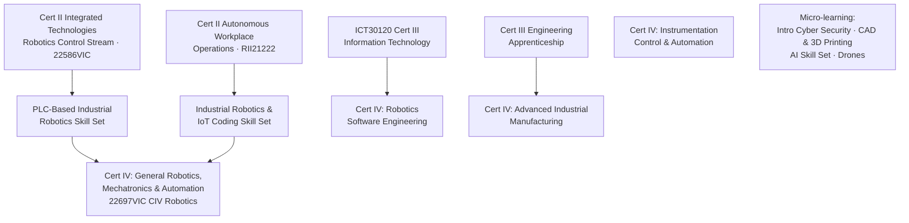
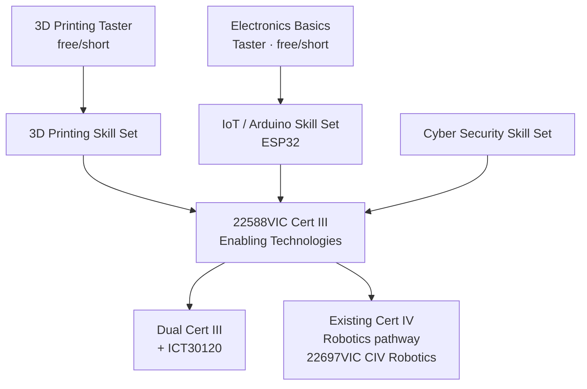

# Robotics & Automation Pathways — Current vs Proposed
**To:** [Director's name] · **From:** [Your name]

## Current published pathway (NMTAFE Robotics & Automation map, Dec 2025)

**The gap:** micro-learning skill sets exist (cyber, CAD/3D printing, AI), but there's no dedicated Cert III on-ramp for IoT/electronics-curious students who aren't ready to commit to Robotics or straight ICT30120 — they either jump into ICT30120 cold or don't enter at all. That's a chunk of interested school leavers with nowhere obvious to land.

## Proposed: Enabling Technologies on-ramp

**The fix:** the same skill-set → Cert III model already proven in the published Robotics map, extended one lane over. It fills the gap without inventing a new structure — it feeds the existing Cert IV Robotics pathway rather than competing with it, and avoids the Electrotechnology-stream CIV's UEE exposure entirely by routing through 22588VIC instead.

**Next:** I'll bring real enrolment/SCH numbers once pulled — see separate quick brief.
